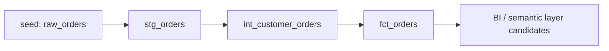

# dbt Analytics Engineering Lab

A portfolio lab that demonstrates how raw operational order data can be shaped into a tested, BI-ready order lifecycle mart with dbt-style staging, intermediate, and mart layers.

This is a synthetic lab, not a production system. The goal is to show practical analytics engineering judgment: clean source data, document assumptions, model reusable business logic, and validate the output before it reaches a dashboard.

## Skill Evidence

| Artifact | What it proves |
| --- | --- |
| `seeds/raw_orders.csv` | Synthetic source design with lifecycle dates, revenue fields, channel, region, and order status edge cases. |
| `models/staging/stg_orders.sql` | Source typing, null handling, status normalization, reusable flags, and Snowflake/BigQuery-conscious dbt SQL. |
| `models/intermediate/int_customer_orders.sql` | Customer-level window logic: order sequence, prior order date, recency gap, lifecycle stage, and revenue-to-date. |
| `models/marts/fct_orders.sql` | BI-ready fact table with recognized revenue, exception flags, fulfillment timing, and dashboard-friendly fields. |
| `models/schema.yml` | dbt documentation plus uniqueness, not-null, accepted-value, and relationship tests. |
| `tests/*.sql` | Singular data quality checks for lifecycle dates, financial values, and customer order sequencing. |

## Model Lineage



## KPI Dictionary

| KPI / field | Definition | Review note |
| --- | --- | --- |
| `recognized_revenue_amount` | Net order amount for shipped or delivered orders; zero for placed, cancelled, and returned orders. | Keeps revenue logic explicit and dashboard-safe. |
| `exception_order_count` | `1` for cancelled or returned orders, otherwise `0`. | Supports operational exception reporting without hiding rows. |
| `days_to_ship` | Calendar days from order date to shipped date. | Validated to prevent negative lifecycle intervals. |
| `days_to_deliver` | Calendar days from order date to delivered date. | Validated to prevent negative lifecycle intervals. |
| `customer_order_number` | Customer order sequence using `row_number()` over order date and order id. | Proves window-function modeling and supports cohort/funnel work. |
| `customer_order_stage` | `new`, `returning`, or `reactivated` based on prior order gap. | Reactivation threshold is documented as a lab assumption. |
| `customer_lifetime_revenue_to_date` | Running sum of recognized net revenue by customer. | Useful for segmentation and lifecycle analysis. |

## Assumptions And Limits

- All rows are synthetic and intentionally small enough for human review.
- `total_amount` represents gross merchandise/order value before discounts.
- `net_order_amount` is `total_amount - discount_amount`.
- Revenue is recognized only for `shipped` and `delivered` statuses in this lab.
- Returned orders remain in the fact table for exception reporting, but their recognized revenue is set to zero.
- A customer is classified as `reactivated` when more than 60 days passed since the prior order.
- The SQL uses dbt cross-database macros such as `dbt.datediff` and `dbt.type_*` where warehouse syntax commonly differs.

## How To Review

With a configured dbt adapter and profile:

```bash
dbt seed
dbt run
dbt test
```

For portfolio review, inspect the SQL and tests in this order:

1. `models/staging/stg_orders.sql`
2. `models/intermediate/int_customer_orders.sql`
3. `models/marts/fct_orders.sql`
4. `models/schema.yml`
5. `tests/`

## Recruiter / Hiring Manager Readout

This repo shows a compact analytics engineering workflow: raw data is staged, business rules are modeled once, a mart is prepared for BI consumption, and quality checks document what must be true before stakeholders rely on the numbers.
