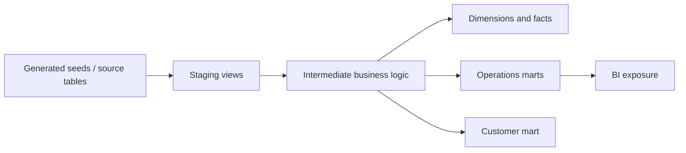

# dbt Analytics Engineering Lab

An executable dbt project that transforms synthetic ERP, TMS, WMS, CRM, product, and planning data into documented, tested, BI-ready analytics marts.

## What this project demonstrates

- dbt sources and deterministically generated reproducible seeds
- staging, intermediate, fact, dimension, and domain mart layers
- explicit model grain and lineage
- generic tests and business-rule singular tests
- source-to-mart revenue and unit reconciliation
- customer profile snapshot using a Type 2 history pattern
- dashboard exposures
- DuckDB local execution and CI-ready commands

## Architecture



## Repository structure

```text
scripts/generate_synthetic_seeds.py  deterministic source generator
seeds/              generated source datasets (ignored by Git)
models/sources.yml  source contracts
models/staging/     typed and normalized views
models/intermediate reusable business logic
models/marts/       facts, dimensions, and BI-ready marts
snapshots/          customer history example
tests/              business-rule and reconciliation tests
macros/             reusable SQL helpers
analyses/           portfolio KPI query
docs/               lineage, metrics, and AI workflow
```

## Run locally

```bash
python -m venv .venv
source .venv/bin/activate  # Windows: .venv\Scripts\activate
pip install -r requirements.txt
make verify
```

`make verify` generates the eight deterministic seed files, runs connection checks, full seed refresh, snapshot, build, documentation generation, and evidence export.

## Models

### Core

- `dim_customers`
- `dim_products`
- `dim_date`
- `fct_order_lines`
- `fct_orders`

### Operations

- `mart_supply_chain_kpis`
- `mart_inventory_risk`
- `mart_forecast_accuracy`

### Customer analytics

- `mart_customer_value`

## Quality gates

The build checks source and model uniqueness, required values, relationships, accepted values, fill-rate bounds, OTIF consistency, revenue and unit reconciliation, lifecycle chronology, additive logistics costs, and customer order-count reconciliation.

## Honest scope

This is a dbt analytics-engineering portfolio lab running locally on DuckDB. It demonstrates modeling, testing, documentation, lineage, and CI patterns without claiming production enterprise deployment.

## Results

Run `make verify` locally or inspect the `dbt-validation-evidence` artifact produced by GitHub Actions.
