# Generated dbt Lineage Evidence

This file is generated from `target/manifest.json` by `scripts/export_validation_evidence.py`. It contains direct dbt dependencies for declared sources, models, and exposures; tests, seeds, snapshots, and macros are intentionally omitted from the diagram.

```mermaid
flowchart TB
  subgraph source_group["Declared sources (8)"]
    n_source_dbt_analytics_engineering_lab_crm_raw_customers["crm.raw_customers"]
    n_source_dbt_analytics_engineering_lab_erp_raw_orders["erp.raw_orders"]
    n_source_dbt_analytics_engineering_lab_planning_raw_demand_forecasts["planning.raw_demand_forecasts"]
    n_source_dbt_analytics_engineering_lab_product_master_raw_products["product_master.raw_products"]
    n_source_dbt_analytics_engineering_lab_product_master_raw_suppliers["product_master.raw_suppliers"]
    n_source_dbt_analytics_engineering_lab_tms_raw_shipments["tms.raw_shipments"]
    n_source_dbt_analytics_engineering_lab_wms_raw_inventory["wms.raw_inventory"]
    n_source_dbt_analytics_engineering_lab_wms_raw_warehouse_activity["wms.raw_warehouse_activity"]
  end
  subgraph model_group["dbt models (20)"]
    n_model_dbt_analytics_engineering_lab_dim_customers["dim_customers"]
    n_model_dbt_analytics_engineering_lab_dim_date["dim_date"]
    n_model_dbt_analytics_engineering_lab_dim_products["dim_products"]
    n_model_dbt_analytics_engineering_lab_fct_order_lines["fct_order_lines"]
    n_model_dbt_analytics_engineering_lab_fct_orders["fct_orders"]
    n_model_dbt_analytics_engineering_lab_int_customer_orders["int_customer_orders"]
    n_model_dbt_analytics_engineering_lab_int_order_fulfillment["int_order_fulfillment"]
    n_model_dbt_analytics_engineering_lab_int_order_lines_enriched["int_order_lines_enriched"]
    n_model_dbt_analytics_engineering_lab_mart_customer_value["mart_customer_value"]
    n_model_dbt_analytics_engineering_lab_mart_forecast_accuracy["mart_forecast_accuracy"]
    n_model_dbt_analytics_engineering_lab_mart_inventory_risk["mart_inventory_risk"]
    n_model_dbt_analytics_engineering_lab_mart_supply_chain_kpis["mart_supply_chain_kpis"]
    n_model_dbt_analytics_engineering_lab_stg_customers["stg_customers"]
    n_model_dbt_analytics_engineering_lab_stg_demand_forecasts["stg_demand_forecasts"]
    n_model_dbt_analytics_engineering_lab_stg_inventory["stg_inventory"]
    n_model_dbt_analytics_engineering_lab_stg_orders["stg_orders"]
    n_model_dbt_analytics_engineering_lab_stg_products["stg_products"]
    n_model_dbt_analytics_engineering_lab_stg_shipments["stg_shipments"]
    n_model_dbt_analytics_engineering_lab_stg_suppliers["stg_suppliers"]
    n_model_dbt_analytics_engineering_lab_stg_warehouse_activity["stg_warehouse_activity"]
  end
  subgraph exposure_group["Declared exposures (2)"]
    n_exposure_dbt_analytics_engineering_lab_customer_value_dashboard["exposure: customer_value_dashboard"]
    n_exposure_dbt_analytics_engineering_lab_supply_chain_control_tower["exposure: supply_chain_control_tower"]
  end
  n_model_dbt_analytics_engineering_lab_int_customer_orders --> n_model_dbt_analytics_engineering_lab_mart_customer_value
  n_model_dbt_analytics_engineering_lab_int_order_fulfillment --> n_model_dbt_analytics_engineering_lab_fct_orders
  n_model_dbt_analytics_engineering_lab_int_order_fulfillment --> n_model_dbt_analytics_engineering_lab_int_customer_orders
  n_model_dbt_analytics_engineering_lab_int_order_fulfillment --> n_model_dbt_analytics_engineering_lab_mart_supply_chain_kpis
  n_model_dbt_analytics_engineering_lab_int_order_lines_enriched --> n_model_dbt_analytics_engineering_lab_fct_order_lines
  n_model_dbt_analytics_engineering_lab_int_order_lines_enriched --> n_model_dbt_analytics_engineering_lab_int_order_fulfillment
  n_model_dbt_analytics_engineering_lab_mart_customer_value --> n_exposure_dbt_analytics_engineering_lab_customer_value_dashboard
  n_model_dbt_analytics_engineering_lab_mart_forecast_accuracy --> n_exposure_dbt_analytics_engineering_lab_supply_chain_control_tower
  n_model_dbt_analytics_engineering_lab_mart_inventory_risk --> n_exposure_dbt_analytics_engineering_lab_supply_chain_control_tower
  n_model_dbt_analytics_engineering_lab_mart_supply_chain_kpis --> n_exposure_dbt_analytics_engineering_lab_supply_chain_control_tower
  n_model_dbt_analytics_engineering_lab_stg_customers --> n_model_dbt_analytics_engineering_lab_dim_customers
  n_model_dbt_analytics_engineering_lab_stg_customers --> n_model_dbt_analytics_engineering_lab_int_order_lines_enriched
  n_model_dbt_analytics_engineering_lab_stg_demand_forecasts --> n_model_dbt_analytics_engineering_lab_mart_forecast_accuracy
  n_model_dbt_analytics_engineering_lab_stg_inventory --> n_model_dbt_analytics_engineering_lab_mart_inventory_risk
  n_model_dbt_analytics_engineering_lab_stg_orders --> n_model_dbt_analytics_engineering_lab_dim_date
  n_model_dbt_analytics_engineering_lab_stg_orders --> n_model_dbt_analytics_engineering_lab_int_order_lines_enriched
  n_model_dbt_analytics_engineering_lab_stg_products --> n_model_dbt_analytics_engineering_lab_dim_products
  n_model_dbt_analytics_engineering_lab_stg_products --> n_model_dbt_analytics_engineering_lab_int_order_lines_enriched
  n_model_dbt_analytics_engineering_lab_stg_shipments --> n_model_dbt_analytics_engineering_lab_int_order_fulfillment
  n_model_dbt_analytics_engineering_lab_stg_suppliers --> n_model_dbt_analytics_engineering_lab_dim_products
  n_model_dbt_analytics_engineering_lab_stg_suppliers --> n_model_dbt_analytics_engineering_lab_int_order_lines_enriched
  n_source_dbt_analytics_engineering_lab_crm_raw_customers --> n_model_dbt_analytics_engineering_lab_stg_customers
  n_source_dbt_analytics_engineering_lab_erp_raw_orders --> n_model_dbt_analytics_engineering_lab_stg_orders
  n_source_dbt_analytics_engineering_lab_planning_raw_demand_forecasts --> n_model_dbt_analytics_engineering_lab_stg_demand_forecasts
  n_source_dbt_analytics_engineering_lab_product_master_raw_products --> n_model_dbt_analytics_engineering_lab_stg_products
  n_source_dbt_analytics_engineering_lab_product_master_raw_suppliers --> n_model_dbt_analytics_engineering_lab_stg_suppliers
  n_source_dbt_analytics_engineering_lab_tms_raw_shipments --> n_model_dbt_analytics_engineering_lab_stg_shipments
  n_source_dbt_analytics_engineering_lab_wms_raw_inventory --> n_model_dbt_analytics_engineering_lab_stg_inventory
  n_source_dbt_analytics_engineering_lab_wms_raw_warehouse_activity --> n_model_dbt_analytics_engineering_lab_stg_warehouse_activity
```

## Direct dependency table

| Node | Direct parents |
|---|---|
| `exposure: customer_value_dashboard` | mart_customer_value |
| `exposure: supply_chain_control_tower` | mart_forecast_accuracy, mart_inventory_risk, mart_supply_chain_kpis |
| `dim_customers` | stg_customers |
| `dim_date` | stg_orders |
| `dim_products` | stg_products, stg_suppliers |
| `fct_order_lines` | int_order_lines_enriched |
| `fct_orders` | int_order_fulfillment |
| `int_customer_orders` | int_order_fulfillment |
| `int_order_fulfillment` | int_order_lines_enriched, stg_shipments |
| `int_order_lines_enriched` | stg_customers, stg_orders, stg_products, stg_suppliers |
| `mart_customer_value` | int_customer_orders |
| `mart_forecast_accuracy` | stg_demand_forecasts |
| `mart_inventory_risk` | stg_inventory |
| `mart_supply_chain_kpis` | int_order_fulfillment |
| `stg_customers` | crm.raw_customers |
| `stg_demand_forecasts` | planning.raw_demand_forecasts |
| `stg_inventory` | wms.raw_inventory |
| `stg_orders` | erp.raw_orders |
| `stg_products` | product_master.raw_products |
| `stg_shipments` | tms.raw_shipments |
| `stg_suppliers` | product_master.raw_suppliers |
| `stg_warehouse_activity` | wms.raw_warehouse_activity |

The exposure nodes are dbt metadata declarations. They do not claim that a dashboard is deployed or running.
