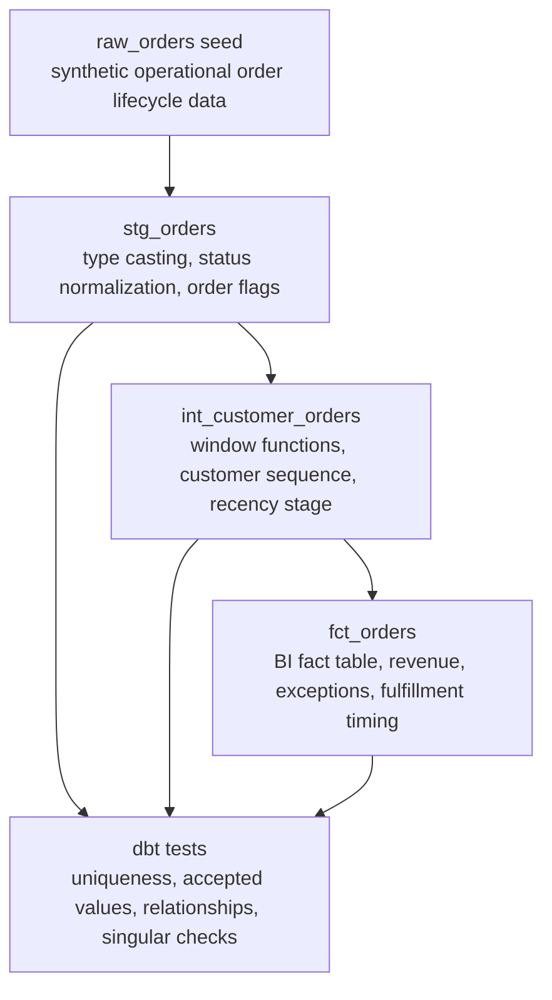

# Lineage Notes

Raw order data flows into `stg_orders`, then into `int_customer_orders`, then into `fct_orders`. This lab is intentionally small, but the shape mirrors a real analytics engineering workflow: isolate source cleanup, centralize reusable business rules, then publish a BI-ready mart.

## Grain

- `raw_orders`: one row per synthetic source order.
- `stg_orders`: one cleaned row per order.
- `int_customer_orders`: one row per order, enriched with customer-level window metrics.
- `fct_orders`: one BI-ready row per order.

## Business Rules

- `status` is normalized in staging so downstream models do not repeat status cleanup.
- `recognized_revenue_amount` is recognized only for shipped or delivered orders.
- Cancelled and returned orders stay in the fact table as operational exceptions.
- `customer_order_stage` classifies orders as `new`, `returning`, or `reactivated` using a 60-day prior-order gap.
- Fulfillment date intervals are calculated in the mart with `dbt.datediff` for warehouse portability.

## Review Criteria

- The fact mart should preserve the order grain: no duplicated `order_id` values.
- Lifecycle dates should move forward: shipped date cannot precede order date, and delivered date cannot precede shipped date.
- Financial amounts should not be negative after staging.
- Customer order sequence should match `row_number()` over each customer history.
