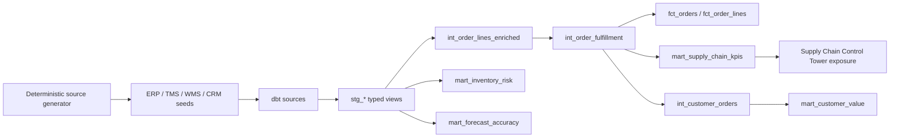

# Lineage and Modeling Decisions

## Grain

- `stg_orders`: one row per order line.
- `int_order_fulfillment`: one row per order.
- `fct_order_lines`: one row per order line.
- `fct_orders`: one row per order.
- `mart_supply_chain_kpis`: one row per order date and warehouse.
- `mart_inventory_risk`: one row per snapshot date, warehouse, and SKU.
- `mart_customer_value`: one row per customer.

The complete project corrects the earlier scaffold mismatch: `fct_orders` depends on `int_order_fulfillment`, which depends on enriched line-level staging data.
